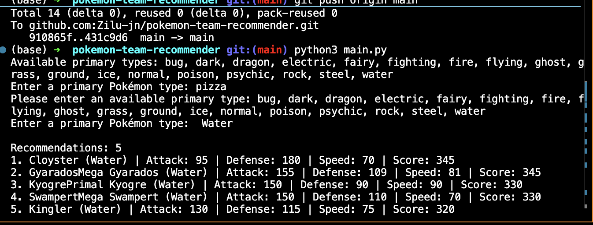
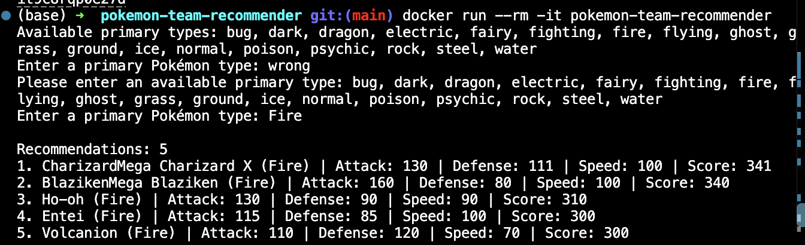

# Pokémon Team Recommender

Choose a primary Pokémon type and receive up to five recommendations ranked by
**Attack + Defense + Speed**. This beginner project uses only Python's standard
library. Its design is documented in [docs/plan.md](docs/plan.md).

## Local setup and run

Install Python 3.12 or newer. Open a terminal in this repository:

```bash
cd /path/to/pokemon-team-recommender
python3 --version
python3 main.py
```

No package installation is needed. On systems where Python is named `python`,
use `python` in place of `python3` in local commands.

Enter a displayed primary type, for example `Fire`. Capitalization and surrounding
spaces do not matter. Invalid or blank input prompts you to try again. Ctrl+C or
closed input exits cleanly. The program exits after displaying one list; run it
again to choose another type.

Each result shows its name, primary type, Attack, Defense, Speed, and score.
Higher scores appear first. Score ties use names alphabetically, ignoring case;
exact ties preserve CSV order. Secondary types are not used. Alternate forms
remain separate entries. Fewer than five matches produces a shorter list.

## Dataset

The original dataset source is Kaggle's
[Pokémon dataset](https://www.kaggle.com/datasets/abcsds/pokemon).
For this project (Repository B), `data/pokemon.csv` was copied unchanged from
Repository A (`pokemon-data-analysis`), where it is stored as `data/Pokemon.csv`.
The source file in Repository A was not modified.

The UTF-8 CSV must include `Name`, `Type 1`, `Attack`, `Defense`, and `Speed`.
Names and primary types must not be blank. Statistics must contain non-negative
whole numbers (for example, `0` or `60`, not `60.5`). Extra columns are ignored.
The entire dataset is checked before user input. Missing columns, bad records,
empty datasets, and unreadable files produce an explanation and exit status 1.
Successful recommendations and cancelled input return status 0.

The file is located relative to `main.py`, so running the script from another
working directory also works.

## Tests and syntax check

From the repository root:

```bash
python3 -m unittest discover -s tests -v
python3 -m py_compile main.py tests/test_main.py
```

Tests use invented records, temporary CSV files, and simulated user input. One
integration test also checks the included dataset from a different directory.
Importing `main` does not launch the program. Syntax checking does not run a prompt.

## Docker

Install Docker Desktop (or Docker Engine) and start it. Run these commands from
the repository root, alongside the Dockerfile:

```bash
docker build -t pokemon-team-recommender .
docker run --rm -it pokemon-team-recommender
```

The final `.` gives Docker the current folder as its build context. `-i` keeps
input open, `-t` supplies an interactive terminal, and `--rm` removes the finished
container. Enter a primary type at the prompt just as you would locally.

The image uses `python:3.12-slim`, works in `/app`, and includes the application,
dataset, and tests. No ports, volumes, third-party packages, or Compose setup are
needed. Rebuild after changing the code, tests, or dataset.

### Verify the container

1. Confirm the build command above succeeds.
2. Run the complete tests in Docker:

   ```bash
   docker run --rm pokemon-team-recommender python -m unittest discover -s tests -v
   ```

3. Run interactively, enter `Fire`, and compare with the local result.
4. Run again and enter an invalid type, then ` Water `; check retry behavior.
5. Confirm that completion returns control to your terminal.
6. Check closed input:

   ```bash
   docker run --rm pokemon-team-recommender
   ```

   Expect an input-closed message and a clean exit without a traceback.

If Docker cannot connect to its engine, start Docker Desktop and retry. Run the
interactive command in a normal terminal that supports `-it`.

## Manual Smoke Test

I manually tested the project locally before beginning the Tester stage.

I ran:

```bash
python3 main.py
```

I first entered `pizza`, which was correctly rejected. I then entered
` Water ` with surrounding spaces. The program accepted the normalized input,
displayed five Water recommendations with statistics and scores, and exited
without a traceback.



I also rebuilt and manually tested the Docker image:

```bash
docker build -t pokemon-team-recommender .
docker run --rm -it pokemon-team-recommender
```

Inside the container, I entered `wrong`, which was rejected, followed by
`Fire`. The container displayed five Fire recommendations and exited
successfully.



## Implementation guide

Comments beginning with `# Repository B - Builder` mark CSV validation, type
normalization, ranking, output, file paths, import safety, tests, and container
setup. All application functions remain in `main.py` to keep the project small.
